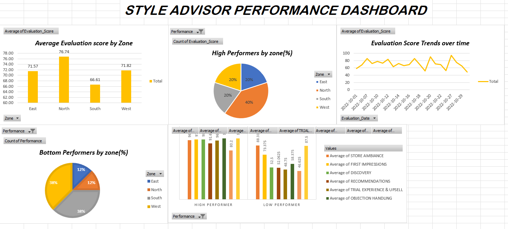

# 📊 Style Advisor Performance Evaluation Dashboard

An Excel-based data analysis project that evaluates the performance of Style Advisors using customer evaluation data. The project classifies advisors into performance categories, analyzes regional trends, and presents actionable insights through Pivot Tables, charts, and an interactive dashboard.

---

## 📷 Dashboard Preview

### Dashboard

---

# 📌 Project Overview

Customer service quality plays a significant role in retail performance. This project analyzes Style Advisor evaluation data collected across multiple store locations to assess individual and regional performance.

The analysis categorizes Style Advisors into performance groups based on their evaluation scores and identifies trends across different zones. The findings are presented through Pivot Tables, charts, and an Excel dashboard to support business decision-making.

---

# 🎯 Objectives

- Evaluate the performance of Style Advisors using evaluation scores.
- Classify advisors into performance categories.
- Compare average evaluation scores across different zones.
- Identify high-performing and low-performing regions.
- Analyze customer service metrics across multiple evaluation criteria.
- Present findings through an Excel dashboard.

---

# 📂 Dataset Overview

The dataset contains **61 Style Advisor evaluation records** across **4 zones** and includes **83 attributes** covering store information, customer experience metrics, evaluation scores, and performance grading.

Some of the evaluation criteria include:

- Store Ambiance
- First Impressions
- Discovery
- Recommendations
- Trial Experience & Upsell
- Objection Handling
- Closure & Care
- Overall Experience
- Evaluation Score
- Performance Grade

---

# 🛠️ Tools & Excel Features Used

- Microsoft Excel
- Pivot Tables
- Pivot Charts
- Dashboard Design
- Charts & Graphs
- IF Function
- Conditional Formatting
- Data Analysis

---

# 📊 Performance Grading

Style Advisors were categorized based on their Evaluation Score:

| Evaluation Score | Performance |
|-----------------|-------------|
| 90–100 | High Performer |
| 70–89 | Average Performer |
| 50–69 | Low Performer |
| Below 50 | Bottom Performer |

---

# 📈 Dashboard Highlights

The dashboard provides insights into:

- Average evaluation score by zone
- High performers by region
- Evaluation score trends over time
- High vs Low performer comparison
- Customer experience metrics across evaluation criteria

---

# 💡 Key Insights

- **North Zone** achieved the highest average evaluation score, indicating strong overall performance.
- **South Zone** recorded the lowest average evaluation score, highlighting opportunities for improvement.
- High-performing advisors consistently outperformed low-performing advisors across all customer experience criteria.
- The largest performance gaps were observed in:
  - Discovery
  - Trial Experience & Upsell
  - Recommendations
- Evaluation scores fluctuated over time without a consistent upward or downward trend.

---

# 📌 Recommendations

Based on the analysis:

- Provide targeted training for lower-performing regions.
- Share best practices from high-performing zones.
- Focus on improving Discovery, Trial Experience & Upsell, and Recommendations.
- Monitor evaluation trends regularly to ensure consistent service quality.

---

# 💼 Skills Demonstrated

- Data Cleaning
- Data Analysis
- Pivot Tables
- Pivot Charts
- Dashboard Development
- Data Visualization
- Business Reporting
- Performance Analysis

---

## 👩‍💻 Author

**Tina Thomas**

